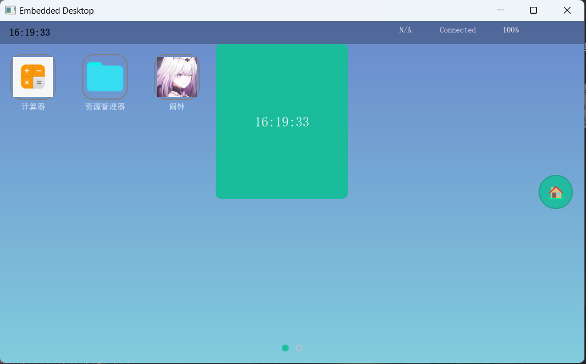
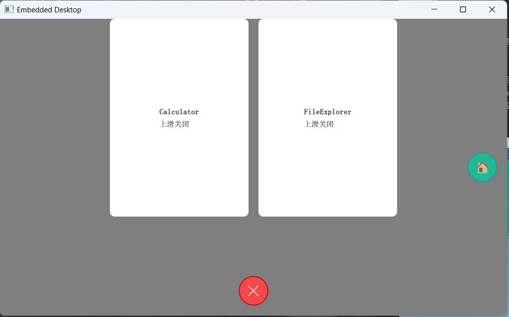
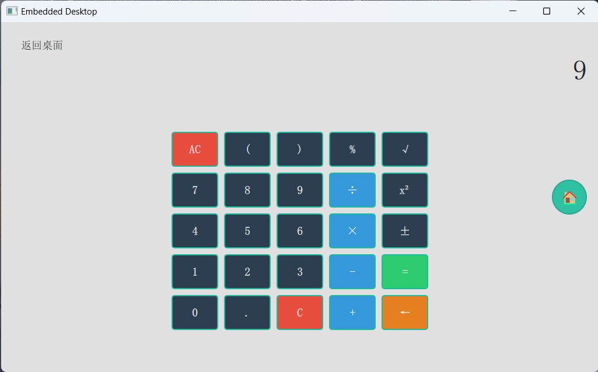
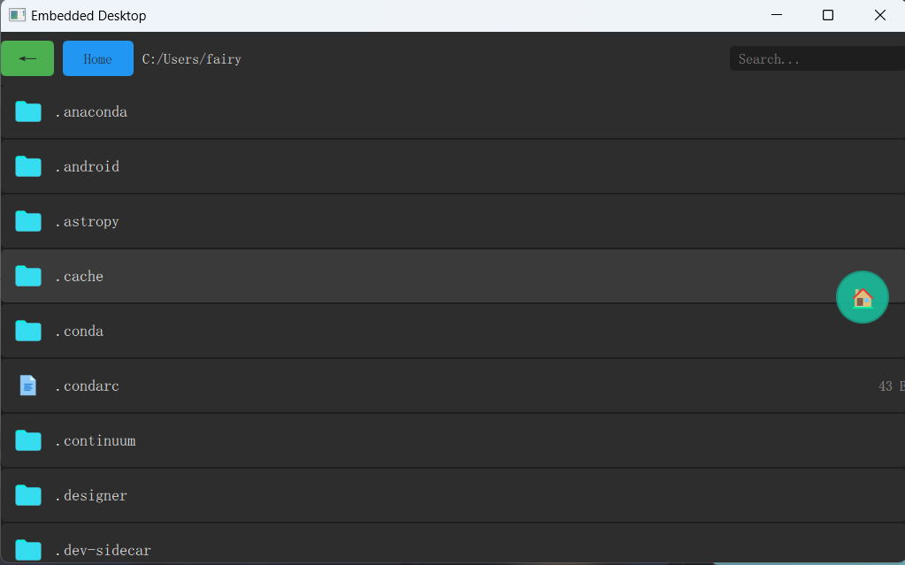
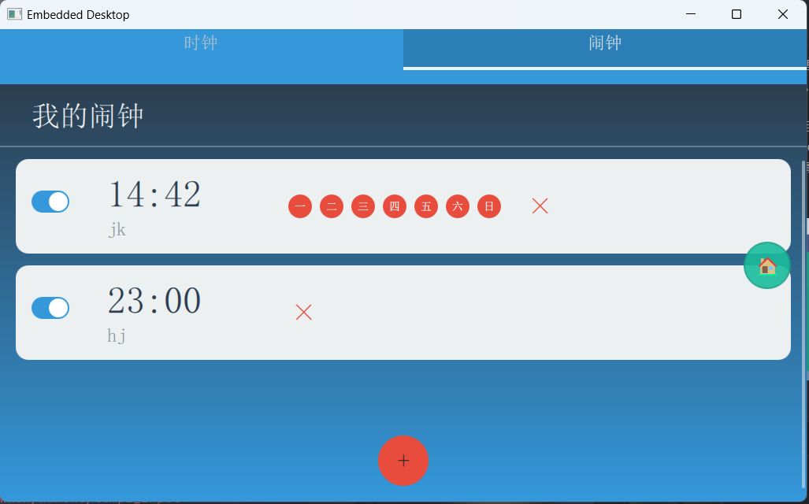
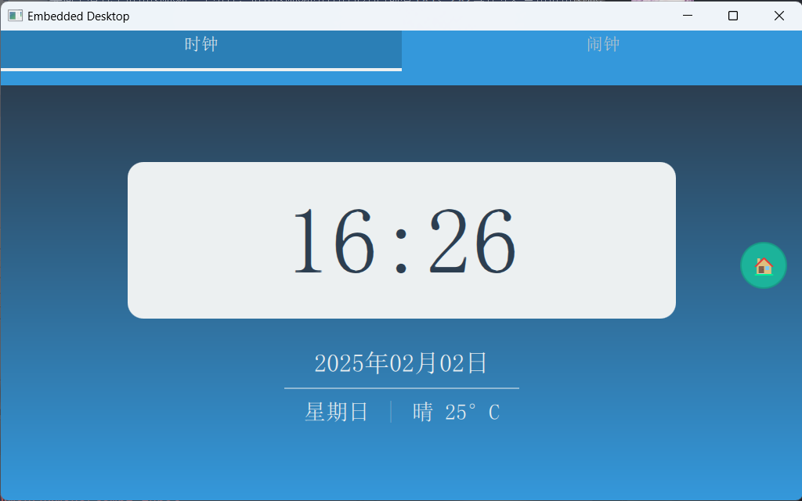

# &nbsp;&nbsp;&nbsp;简简介

---
&nbsp;&nbsp;&nbsp;&nbsp;
基于正点原子I.MX6ULL资料盘里的Qt综合例程学习，开发一个简易的Qt桌面，模仿现代手机/平板的界面设计，可供初学者学习参考。
工程使用CLion开发，但已经在Qt Creator上验证过（主机和虚拟机），并传输过imx6ull开发板上验证

&nbsp;&nbsp;&nbsp;&nbsp;
桌面上有几个应用图标和一个组件，应用图标和组件的大小目前有1×1、2×2等尺寸。点击应用图标，会使用Loader加载相应的应用界面。
从屏幕底部向上滑动，可以看到应用后台，向上滑动应用后台卡片可以清除该应用后台，再次从底部向上滑动可以返回主界面。
后台卡片可以左右移动，点击后台卡片可以再次进入对应的应用界面。
  
相关博客：[初试Qt桌面开发总结](https://blog.csdn.net/m0_74349248/article/details/145343311?spm=1011.2415.3001.5331)

 

这是主界面，目前设置了两个桌面页面，另一个页面与这个相同，可以后续自己添加页面或者应用，都在ui/desktop.qml中修改
由于使用到的Qt库不支持OpenGL，所以图片不好圆角剪切，应用的图标显得有些突兀。

后台界面做得有些粗糙，清除单个应用后台还有些问题，凑合凑合用

这是计算器应用

这是文件资源管理器应用

这是闹钟应用，里面有时钟和闹钟两个页面

